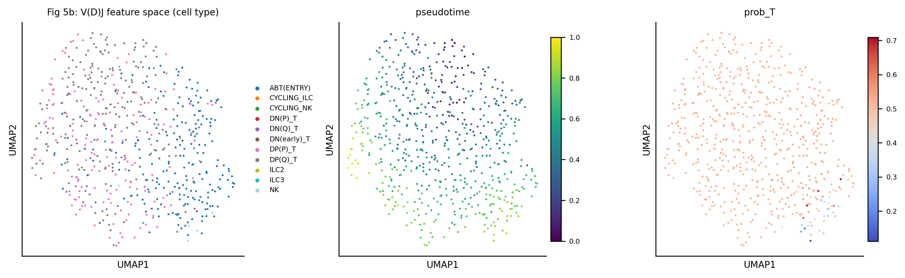
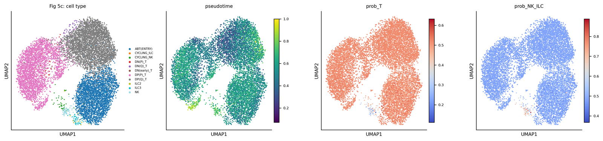
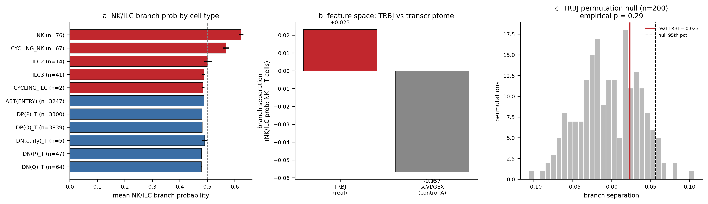
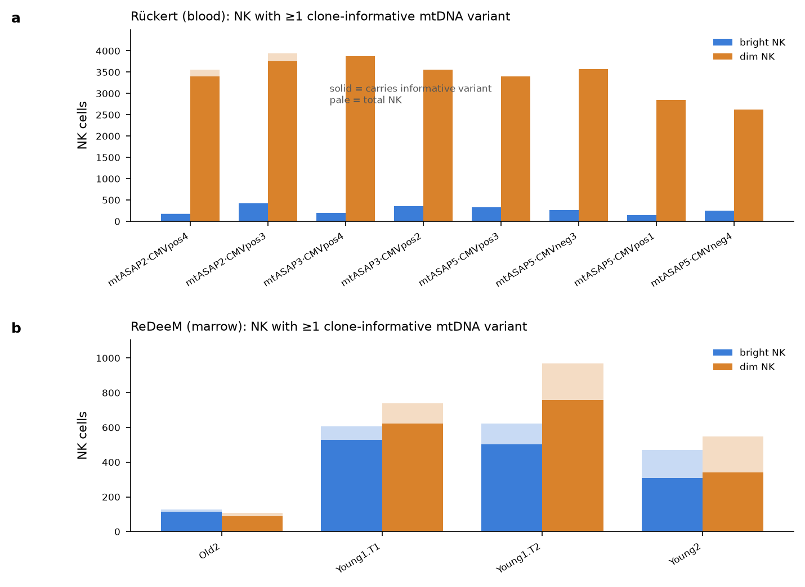
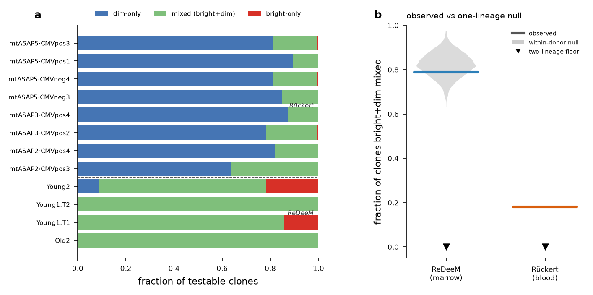
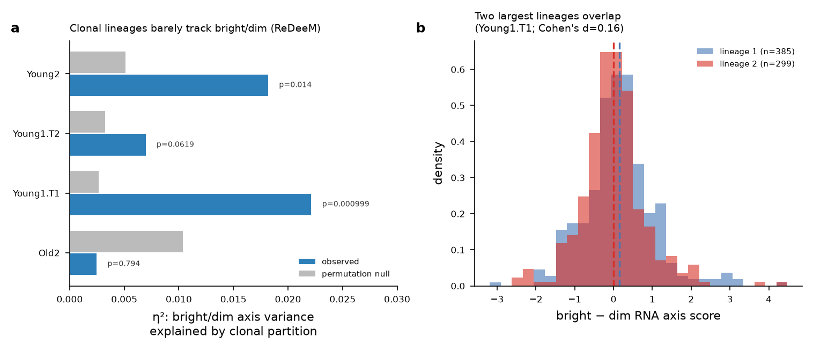
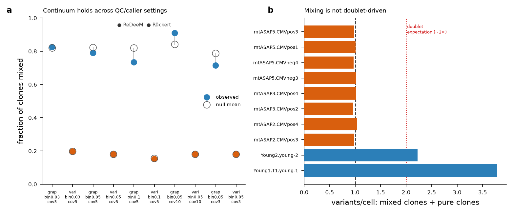
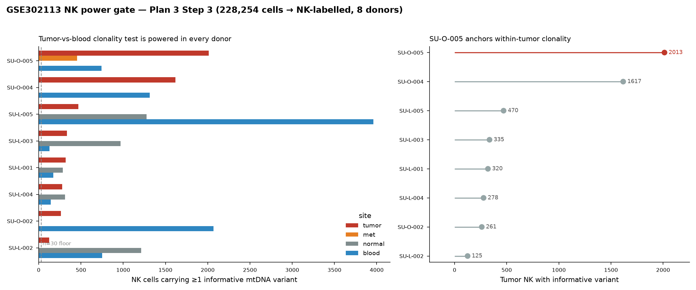
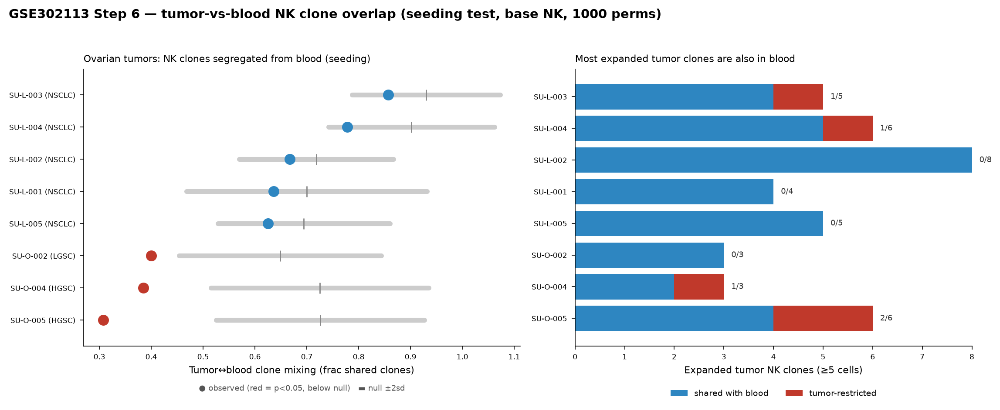
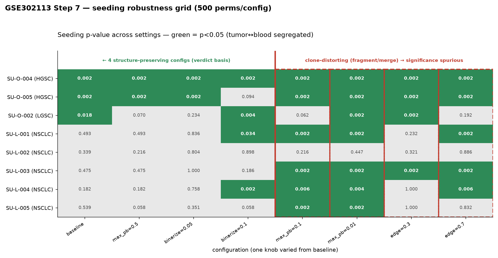

# Developmental origins of NK cells: TCR rearrangement footprints, thymic/aborted‑T pathways, and tumor clonal restriction

**A comprehensive project report**

*Gladstone × Claude Life Sciences Hackathon project. This document is a standalone, self‑contained account of the research questions, the datasets obtained, every analysis stream attempted, the results, and their interpretation — including the honest limits of what the data can and cannot show.*

---

## Table of contents

1. [Executive summary](#1-executive-summary)
2. [Background and central hypothesis](#2-background-and-central-hypothesis)
3. [The four questions](#3-the-four-questions)
4. [Two orthogonal evidence streams](#4-two-orthogonal-evidence-streams)
5. [Datasets: provenance and characteristics](#5-datasets-provenance-and-characteristics)
6. [Stream A — the TCR‑footprint line](#6-stream-a-the-tcrfootprint-line)
7. [Stream B — the mtDNA lineage‑tracing line](#7-stream-b-the-mtdna-lineagetracing-line)
8. [Complementary clonal‑tracking re‑analysis (Six 2020)](#8-complementary-clonaltracking-reanalysis-six-2020)
9. [Synthesis: what the project established](#9-synthesis-what-the-project-established)
10. [Honest limits and what would settle the open questions](#10-honest-limits-and-what-would-settle-the-open-questions)
11. [Literature cited](#11-literature-cited)
12. [Reproducibility: code, data, and compute](#12-reproducibility-code-data-and-compute)

---

## 1. Executive summary

The textbook model treats human CD56^bright and CD56^dim NK cells as a single linear differentiation continuum (bright = immature → dim = mature effector). This project tested the alternative that the field **conflates peripheral differentiation with developmental origin** — that a subset of NK cells, enriched in the CD56^bright compartment, may arise via a **thymic / aborted‑T‑cell developmental pathway** rather than canonical bone‑marrow NK development, and that a molecular footprint of that history could survive as **non‑productive / partial TCR rearrangements**. A linked hypothesis held that **tumor‑infiltrating NK cells are clonally restricted**.

The work ran as **two orthogonal, semi‑independent evidence streams** — a **TCR‑footprint** line (single‑cell VDJ) and an **mtDNA lineage‑tracing** line (somatic mitochondrial variants) — because each can address questions the other structurally cannot. The headline results:

| # | Question | Stream | Verdict | Confidence |
|---|----------|--------|---------|:----------:|
| **Q1** | Do NK cells carry non‑productive/partial TCR rearrangements above background? | TCR | **Yes, but only marginally above the noise floor** — NK non‑productive‑only footprint ≈ 0.4–0.5%, roughly 3–18× below αβ/γδ T cells | moderate |
| **Q2** | Does a *subset* (CD56^bright) preferentially carry the footprint? | TCR | **No detectable bright‑vs‑dim enrichment** (OR ≈ 0.7–1.2, all p > 0.45) | moderate |
| **Q3** | Do NK cells develop via a thymic / aborted‑T (DN‑branch) pathway? | TCR + mtDNA | **Reproducible in direction but statistically fragile** — the Dandelion NK‑from‑DN branch replicates qualitatively but is not significant against a permutation null (empirical p = 0.29) and is transcriptome‑adjacent, not TCR‑footprint‑driven | low |
| **Q2′** | Are CD56^bright and CD56^dim NK one lineage or two? | mtDNA | **One lineage / continuum** — bright and dim share somatic‑mtDNA clones exactly as a single well‑mixed lineage predicts | **high** |
| **Q4** | Are tumor‑infiltrating NK cells clonally restricted? | mtDNA | **Tumor‑type‑dependent** — restricted in high‑grade serous **ovarian** cancer, passive/polyclonal in **lung** | moderate–high |
| **Origin** | Are NK clonally closer to T or to myeloid at the progenitor level? | clonal tracking | **Myeloid‑leaning, but the human evidence is genuinely mixed** (5/6 patients, p ≈ 0.06) | low–moderate |

The two streams point in a consistent direction on the specific claim they were best able to test: **the strongest, cleanest result — that bright and dim NK are one clonal lineage (high confidence) — argues against the two‑origin premise as originally framed**, while the TCR‑footprint signal that motivated the project turns out to be real but weak and not subset‑specific. The tumor‑restriction and progenitor‑origin analyses produced defensible, publishable secondary findings that sharpen (and in one case revise) the existing literature.

---

## 2. Background and central hypothesis

Human NK cells are conventionally split into two peripheral subsets: **CD56^bright CD16^−** (cytokine‑producing, less cytotoxic, minority in blood) and **CD56^dim CD16^+** (cytotoxic effectors, majority in blood). The prevailing developmental model reads these as sequential stages of one maturation continuum — CD34^+ progenitor → CD56^bright → CD56^dim — with secondary lymphoid tissue as a site of terminal maturation ([Freud et al. 2006, *J Exp Med*](https://doi.org/10.1084/jem.20052507); [Freud, Mundy‑Bosse, Yu & Caligiuri 2017, *Immunity*](https://doi.org/10.1016/j.immuni.2017.10.008)).

**The project's central contention is that this framing conflates two different things**: *peripheral differentiation* (a bright cell can adopt a dim phenotype) and *developmental origin* (bright and dim may descend from different precursors). Both can be true simultaneously, and peripheral plasticity may have masked a developmental divergence. Several strands of evidence make this more than speculation:

- **Two developmentally distinct NK pathways exist in mouse and map onto human subsets.** [Ding et al. 2024, *Nat Immunol*](https://doi.org/10.1038/s41590-024-01865-2) identified an early NK progenitor (ENKP) that develops into NK cells independently of the common ILC precursor (ILCP), and reported that **human CD56^dim resemble ENKP‑derived NK and human CD56^bright resemble ILCP‑derived NK** — the strongest published statement that bright and dim are not simply sequential stages.
- **A human thymic NK route branching near DN thymocytes now exists.** [Reiß et al. 2025, *Sci Adv*](https://doi.org/10.1126/sciadv.adv9650) describe a thymic ILC1‑like progenitor (thyILC1) closely related by scRNA‑seq to CD34^+ double‑negative (DN) thymocytes, thymus‑dependent, biased to KIR^+NKG2A^+ NK. The classic mouse thymic NK pathway ([Vosshenrich et al. 2006, *Nat Immunol*](https://doi.org/10.1038/ni1395)) produces CD11b^lo CD16^− cells explicitly "reminiscent of human CD56^bright."
- **NK cells can carry TCR gene rearrangements.** [Leiden et al. 1988, *Immunogenetics*](https://doi.org/10.1007/BF00376117) found rearranged TCRβ/γ in human NK clones while showing NK activity does *not* require TCR rearrangement — consistent with a developmental relic rather than a functional receptor. Standard single‑cell TCR pipelines discard non‑productive contigs and treat any TCR reads in NK cells as ambient contamination, so this putative footprint is routinely removed before analysis.
- **The Dandelion VDJ package reports a buried NK/ILC‑from‑DN signal.** [Suo, Tuong et al. 2023, *Nat Biotechnol*](https://doi.org/10.1038/s41587-023-01734-7) built a pipeline specifically to *retain* non‑productive and partially spliced V(D)J contigs and a VDJ‑feature pseudotime, and reported insights into ILC/NK developmental origins branching from early T‑cell development.

**The hypothesis, stated formally (H1–H4):**

1. **H1** — NK cells contain non‑productive/partial TCR rearrangements above ambient background.
2. **H2** — a *subset* of NK cells (hypothesized CD56^bright‑like) preferentially carries them.
3. **H3** — a subset of NK cells shows a transcriptional signature consistent with thymic / aborted‑T (DN‑branch) development.
4. **H4** — tumor‑infiltrating NK cells are biased toward this origin and are **clonally restricted**.

**Epistemic guardrails (owner‑stated, load‑bearing throughout):** detecting TCR in NK cells does **not** by itself demonstrate thymic development — rearrangement presence and thymic origin are interrelated but distinct. And mtSNP lineage tracing establishes clonal **relatedness/restriction**, **not** developmental origin. A crucial literature counterpoint must also be respected: [Ribeiro et al. 2010, *J Immunol*](https://doi.org/10.4049/jimmunol.1002273) argues thymic NK arise from a dedicated NK‑committed route, **not** from aborted T precursors — so "thymic origin" ≠ "aborted‑T origin," and the aborted‑T claim is the stronger, more contested one.

---

## 3. The four questions

The owner decomposed the thesis into four questions, ordered by bioinformatic tractability (**Q1 < Q2 < Q4 < Q3**, easiest first):

1. **Q1 — Do NK cells contain non‑productive/partial TCR rearrangements?** (most tractable)
2. **Q2 — Do a *subset* of NK cells preferentially carry them?**
3. **Q3 — Do a subset of NK cells develop via a thymus / aborted‑T pathway?** (hardest; needs developmental references)
4. **Q4 — Are tumor‑infiltrating NK cells clonally restricted / biased to the bright‑origin phenotype?** (needs tumor data + mtSNP)

A fifth question emerged as the cleanest to answer directly and became the mtDNA stream's flagship:

- **Q2′ — Are CD56^bright and CD56^dim NK one developmental lineage or two?** Somatic mtDNA clones shared between the subsets = common progenitor (continuum); disjoint clones = two pathways.

---

## 4. Two orthogonal evidence streams

A central design decision was that the project ran **two orthogonal, semi‑independent evidence streams in parallel**, both investigating NK developmental origins. They are *not* a pivot from one to the other — each addresses questions the other cannot:

| | **Stream A — TCR footprint** | **Stream B — mtDNA lineage tracing** |
|---|---|---|
| **Barcode** | V(D)J rearrangement (discrete, developmental relic) | Somatic mtDNA variants (continuous, accrue over divisions) |
| **Reads out** | *Whether* a cell passed through a rearranging (T‑like) developmental state | *Clonal relatedness* — which cells share an ancestor |
| **Can test** | Q1 (footprint exists), Q2 (subset carries it), Q3 (DN‑branch trajectory) | Q2′ (one lineage vs two), Q4 (tumor restriction), NK↔T shared‑clone origin |
| **Cannot test** | Clonal relationships; developmental origin *per se* | *Whether* the shared ancestor was thymic/T‑like — clonality ≠ origin |
| **Structural limit** | The rearrangement footprint lives in **genomic DNA**; single‑cell RNA‑VDJ sees only expressed contigs. No thymic mtscATAC dataset exists. | mtDNA resolution is bounded by clonal expansion depth and coverage; deep ancestral splits go unsampled. |

The two streams share some datasets (the TCR stream may reuse objects downloaded for the mtDNA stream) but are otherwise independent lines of evidence. Where they converge — as on the one‑lineage‑vs‑two question — the convergence is the strongest result the project produced.

---

## 5. Datasets: provenance and characteristics

Every dataset below was obtained from a public repository. The **paper it came from** and the **accession** are both linked. Heavy raw data (FASTQ, fragment files, Seurat/AnnData objects) live in the non‑git `HPC_data/Thymic_NK_development/` tree and on the Marvin HPC Lustre workspace; light outputs and all code are in the git repositories (see §12).

### Stream A — TCR footprint

| Dataset | Accession | Paper | Method | What it provides | NK content | Role |
|---------|-----------|-------|--------|------------------|:----------:|------|
| **Suo developing‑immune atlas** | [E‑MTAB‑11343](https://www.ebi.ac.uk/biostudies/arrayexpress/studies/E-MTAB-11343) (GEX); [E‑MTAB‑11388](https://www.ebi.ac.uk/biostudies/arrayexpress/studies/E-MTAB-11388) (αβTCR VDJ, ENA [ERP135310](https://www.ebi.ac.uk/ena/browser/view/PRJEB51634)) | [Suo et al. 2022, *Science*](https://doi.org/10.1126/science.abo0510) | 10x 5′ scRNA + paired scVDJ | Fetal multi‑organ (liver, thymus, BM, spleen, gut); the atlas the Dandelion NK/ILC‑origin claim was built on | 677 thymic NK‑ILC; 70 thymic cells with TRB | Dandelion reproduction (Q3); GEX object = CELLxGENE collection `b1a879f6-5638-48d3-8f64-f6592c1b1561`, 111,706 cells |
| **Domínguez Condé cross‑tissue atlas** | [PRJEB51634 / E‑MTAB‑11536](https://www.ebi.ac.uk/biostudies/arrayexpress/studies/E-MTAB-11536) | [Domínguez Condé et al. 2022, *Science*](https://doi.org/10.1126/science.abl5197) | 10x 5′ scRNA + paired VDJ, CellTypist | ~360k cells, 16 tissues, healthy adult; curated NK annotation | 366 NK with contig / 9,142 NK denominator (310 tissue, 33 marrow, 4 blood, **0 thymus**) | Bright‑vs‑dim footprint quantification (Q1/Q2); VDJ re‑aligned (77 runs: 63 αβ + 14 γδ, 220.6 GB) |
| **Dandelion NMD control** | [E‑MTAB‑12524](https://www.ebi.ac.uk/biostudies/arrayexpress/studies/E-MTAB-12524) | [Suo, Tuong et al. 2023, *Nat Biotechnol*](https://doi.org/10.1038/s41587-023-01734-7) | 10x + cycloheximide (NMD block) | Stabilises non‑productive TCR/BCR transcripts — evidence non‑productive contigs are genuine, not artifact | PBMC | Pipeline validation / noise‑floor logic |

### Stream B — mtDNA lineage tracing

| Dataset | Accession | Paper | Method | What it provides | NK content | Role |
|---------|-----------|-------|--------|------------------|:----------:|------|
| **Rückert NK memory** | [GSE197008](https://www.ncbi.nlm.nih.gov/geo/query/acc.cgi?acc=GSE197008) / [GSE197037](https://www.ncbi.nlm.nih.gov/geo/query/acc.cgi?acc=GSE197037) | Rückert et al. (mtASAP/ASAP‑seq) | mtscATAC + ASAP‑seq (surface protein) | Sorted blood NK; CD56/CD16 protein gate for bright/dim | **29,536 NK**, 3 ASAP samples / 6 donors | **Plan 2** primary — bright‑vs‑dim, blood arm |
| **Weng ReDeeM atlas** | [GSE219014](https://www.ncbi.nlm.nih.gov/geo/query/acc.cgi?acc=GSE219014) family (+ Figshare [ReDeeM‑V](https://doi.org/10.6084/m9.figshare.24418966.v1), [Seurat RDS](https://doi.org/10.6084/m9.figshare.23290004.v1)) | [Weng et al. 2024, *Nature*](https://doi.org/10.1038/s41586-024-07066-z) | ReDeeM (deepest mtDNA) | Bone‑marrow BMMC + CD34; progenitor‑proximal; RNA labels | **4,189 NK**, 4 donors | **Plan 2** complement (marrow); NK↔T origin probe |
| **Liu tumor mtscATAC** | [GSE302113](https://www.ncbi.nlm.nih.gov/geo/query/acc.cgi?acc=GSE302113) | [Liu et al. 2026, *Cancer Cell*](https://doi.org/10.1016/j.ccell.2026.05.006) (bioRxiv [10.1101/2025.07.16.665245](https://doi.org/10.1101/2025.07.16.665245)) | mtscATAC‑seq | NSCLC + ovarian, matched tumor/normal/blood; 228,254 cells | 125–2,013 tumor NK w/variant per donor | **Plan 3** sole primary — tumor clonal restriction (Q4) |

### Complementary — clonal tracking

| Dataset | Accession | Paper | Method | Role |
|---------|-----------|-------|--------|------|
| **Six 2020 gene‑therapy IS** | GitHub [BushmanLab/HSC_diversity](https://github.com/BushmanLab/HSC_diversity) (`data/intSites.mergedSamples.collapsed.csv.gz`, 404,335 IS rows; raw SRA [SRP139090](https://www.ncbi.nlm.nih.gov/sra/?term=SRP139090)) | [Six et al. 2020, *Blood*](https://doi.org/10.1182/blood.2019002350) | Lentiviral integration‑site clonal tracking, 5 FACS‑sorted lineages, 6 patients | NK‑vs‑T‑vs‑myeloid progenitor origin (population‑clone resolution) |

**A note on what was surveyed but not usable.** An exhaustive GEO sweep (155 series across 28 search terms) confirmed that a **thymic mtscATAC / ReDeeM / MAESTER dataset does not exist** — the single biggest data gap for testing Q3 by lineage tracing. Deep‑mtDNA NK content is dominated by the three datasets in hand; other deep‑mtDNA series (Penter, Lareau, Weng bystander) carry NK only as bystanders. For GSE302113, the authors' cell‑type annotations are **not public** (only raw + chromatin‑accessibility + mtDNA calls are deposited), so NK identification required computing ATAC gene‑activity at marker loci (accessible *NCR1/GNLY/KLRD1/NKG7*, closed *CD3D/CD8A/CD14*) from the fragment files directly.

---

## 6. Stream A — the TCR‑footprint line

This stream asks the first three questions directly from single‑cell V(D)J data: does a TCR‑rearrangement footprint exist in confidently‑annotated NK cells (Q1), is it concentrated in the CD56^bright subset (Q2), and do NK cells trace a DN‑branch developmental trajectory (Q3)?

### 6.1 The footprint‑detection design

The analysis design (a scaffold with an eight‑threat control table, T1–T8) treats **productive** TCR as an *exclusion* criterion — a productive, functional TCR in an "NK" cell most likely means a misannotated T cell or a doublet. The signal of interest is the **non‑productive / partial** rearrangement: the relic a cell would carry if it had passed through a rearranging developmental state but never completed a functional receptor. The eight threats the design must clear: ambient TCR mRNA, doublets, NMD/capture dropout, convergent recombination, misannotated NK, batch, reference/aligner choice, and the noise floor set by cells that never rearrange (e.g. myeloid).

Two facts frame the interpretation of every number below:
- **T‑cell TCR mRNA bleeds into NK droplets as ambient contamination**, and it is worse in dense‑T tissue and tumor (NK "any contig" rates run ~4% in adult blood/tissue atlases but ~19–22% in lung tumor).
- **NMD and capture dropout *deflate* the true relic** — non‑productive transcripts are nonsense‑mediated‑decay targets, so the measured footprint is a floor, not a ceiling. The [E‑MTAB‑12524](https://www.ebi.ac.uk/biostudies/arrayexpress/studies/E-MTAB-12524) cycloheximide experiment exists precisely to show these transcripts are genuine.

### 6.2 Q1/Q2 result — the footprint exists but is weak and not subset‑specific

Quantifying non‑productive TCR contigs in confidently‑annotated NK cells from the Domínguez Condé cross‑tissue atlas, split by CD56^bright vs CD56^dim and benchmarked against T‑cell classes:

**Footprint by cell class** (the noise‑floor benchmark):

| Cell class | n aligned | any contig % | **non‑productive‑only %** | any‑non‑productive % |
|------------|----------:|-------------:|--------------------------:|---------------------:|
| **NK_bright** | 4,071 | 4.10 | **0.393** | 1.351 |
| **NK_dim** | 5,071 | 3.92 | **0.532** | 1.065 |
| gdT (γδ T) | 5,524 | 40.10 | 7.223 | 15.550 |
| CD8_T | 26,416 | 98.07 | 2.873 | 34.010 |
| CD4_T | 44,900 | 93.83 | 1.826 | 31.180 |

NK cells do carry non‑productive‑only rearrangements — but at ~0.4–0.5%, roughly **15–18× below γδ T cells** and **5–7× below αβ T cells**. The signal sits just above what an ambient/dropout floor would produce; it is real but marginal.

**Bright vs dim footprint** (the direct Q2 test):

| Metric | bright k/n (%) | dim k/n (%) | OR | p |
|--------|:---------------:|:------------:|:----:|:----:|
| Non‑productive‑only (aborted relic) | 12/2762 (0.43%) | 17/2847 (0.60%) | 0.726 | 0.459 |
| Any non‑productive contig | 39/2762 (1.41%) | 35/2847 (1.23%) | 1.151 | 0.561 |
| Any TCR contig at all | 120/2762 (4.34%) | 129/2847 (4.53%) | 0.957 | 0.746 |

**There is no detectable enrichment of the footprint in the CD56^bright subset.** Every comparison is non‑significant (p > 0.45), and the non‑productive‑only odds ratio actually points slightly the *wrong* way (bright < dim). **H2 is not supported by this dataset.**

### 6.3 Q3 result — the Dandelion NK‑from‑DN branch reproduces in direction but is statistically fragile

The project reproduced the Dandelion trajectory analysis end‑to‑end: the GEX object is the Suo Lymphoid atlas (111,706 cells), and the VDJ was **re‑derived from scratch** from 64 αβTCR libraries ([E‑MTAB‑11388](https://www.ebi.ac.uk/biostudies/arrayexpress/studies/E-MTAB-11388), ENA ERP135310) using `cellranger vdj --chain TR` on all_contig, then `sc-dandelion` preprocessing. Palantir pseudotime was run in VDJ‑feature space to score the NK/ILC‑from‑DN branch.

*VDJ‑feature‑space UMAP with the NK/ILC branch resolved off the double‑negative thymocyte trajectory — the qualitative reproduction of the Suo/Dandelion Fig 5b layout.*

*Palantir branch probabilities toward the NK / ILC terminal state. The branch **reproduces qualitatively**: NK (n = 76) prob_NK/ILC = 0.623 and cycling‑NK (n = 67) = 0.569, both above the T‑baseline ≈ 0.48.*

So the direction reproduces. But a driver dissection asked *what carries the signal*, and the answer undercuts the TCR‑footprint interpretation:

*Decomposing the branch signal: the **real TRBJ‑feature separation contributes +0.023**; a **GEX/transcriptome control contributes −0.057** (i.e. transcriptome structure alone, with VDJ features removed, does not reproduce it in the expected direction); and against a **permutation null (n = 200: mean −0.004, sd 0.039, 95th percentile +0.057)** the observed separation gives an **empirical p = 0.29 — not significant**.*

Two further checks were decisive. A raw‑contig audit found **0 V‑less non‑productive TRB contigs** in the re‑alignment — the specific defining signal the original claim rested on was absent from the re‑derived VDJ. And the branch signal is **transcriptome‑adjacent, not TCR‑footprint‑driven**.

**Bottom line for Q3 (TCR stream):** the NK‑from‑DN branch is reproducible in *direction* but statistically fragile and not driven by the TCR footprint itself — the discrepancy with the published claim is most consistent with a pipeline/reference difference (aligner, VDJ reference version) rather than a robust developmental signal. This is a **low‑confidence** result and is presented as such.

*(Trajectory environment `ddl-traj`: scanpy 1.10.4, dandelion 0.5.7, scvi‑tools 1.3.3, palantir 1.4.4, pertpy 0.10.0. Full memo: [`results/dandelion_reproduction/dandelion_reproduction_memo.md`](results/dandelion_reproduction/dandelion_reproduction_memo.md).)*

---

## 7. Stream B — the mtDNA lineage‑tracing line

Somatic mitochondrial‑DNA variants act as natural clonal barcodes readable from single‑cell ATAC/RNA with simultaneous cell‑state readout ([Ludwig et al. 2019, *Cell*](https://doi.org/10.1016/j.cell.2019.01.022); [Lareau et al. 2023, *Nat Protoc*](https://doi.org/10.1038/s41596-022-00795-3)). All three plans below share a frozen analysis core, the **`mtclone`** package (io / qc / clones / metrics / classify; environment `mtclone`, python 3.11), so clone calling, binarization (default heteroplasmy threshold 0.07), and informative‑variant selection are identical across datasets.

### 7.1 Plan 2 (flagship): CD56^bright and CD56^dim NK are **one lineage, not two**

**Question.** If bright and dim NK descend from common progenitors, they should **share** somatic‑mtDNA clones; if they arise from separate pathways, their clones should be **disjoint**.

**Design.** Per donor, `frac_mixed_clones` = the fraction of testable clones containing *both* a bright and a dim NK, compared to a within‑donor label‑shuffle null (1000×) that fixes clone structure and the bright base‑rate. The test was run on two complementary arms — Rückert blood (protein‑gated) and ReDeeM marrow (RNA‑labelled).

*Power gate: the test is adequately powered in both arms — the great majority of NK carry ≥1 informative variant.*

**The core test.** Observed `frac_mixed` lands on the one‑lineage null in **all 12 donor‑units and both pooled arms**:

| Arm | observed | one‑lineage null (mean [95% CI]) | two‑lineage floor | p |
|-----|:--------:|:--------------------------------:|:-----------------:|:--:|
| ReDeeM (marrow, RNA) | 0.789 | 0.822 [0.711, 0.921] | 0.000 | ns |
| Rückert (blood, protein) | 0.180 | 0.179 [0.177, 0.182] | 0.000 | ns |

*The decisive panel: a true two‑lineage world drives `frac_mixed → 0.000` (well below both observed values and both null CIs), so the test **could** detect segregation — and does not. Each observed value sits squarely on its own single‑lineage null. The two arms differ in absolute value by clone‑definition design (ReDeeM's few large lineages nearly all span both subsets; Rückert's many size‑2 groups in ~90%‑dim blood mix less), but each lands on its matched null.*

**The converse test.** Taking the clonal partition label‑free and asking whether the major lineages carry any bright/dim transcriptional signal: clonal lineage explains a **negligible** share of the bright/dim axis (**max η² = 0.022**; the two largest ReDeeM lineages differ by **Cohen's d = 0.16**).

*There are not "two clonal lineages mapping to bright and dim" — clonal identity barely moves the bright/dim axis.*

**Robustness.** The continuum holds across binarization thresholds (0.03–0.10), coverage floors (3–10×), and both clone callers. Mixing is not doublet‑driven (mixed:pure variants/cell ratio 0.95–1.04; dropping the top‑5% variant‑load cells leaves observed unchanged, 0.857 → 0.857).

*The one‑lineage verdict is stable across every QC/caller setting swept.*

**Verdict — high confidence.** Somatic mtDNA clones are **shared** between CD56^bright and CD56^dim NK, as a single well‑mixed lineage predicts, and a true two‑lineage structure would have been clearly detectable but is not seen. This replicates across **blood *and* marrow**, two mtDNA chemistries (raw mtASAP + UMI‑consensus ReDeeM), and two label modalities (protein + RNA); the test has **demonstrated power** (simulated segregation drives the statistic to zero); and it is **stable** across every setting swept. This is positive evidence for a common progenitor and a bright↔dim continuum — consistent with the classic maturation model and, notably, **arguing against the project's two‑origin premise as originally framed**.

*Honest limit:* the **ENKP/ILCP transcriptional origin** ([Ding 2024](https://doi.org/10.1038/s41590-024-01865-2)) was **not** tested — the exported marker panels lack progenitor signatures, so "one clonal lineage" does not exclude two transcriptionally distinct progenitor inputs that converge clonally. ReDeeM marrow under‑samples CD56^dim (4 donors); Rückert blood is ~90% dim, so bright is the limiting compartment. Full results: [`scripts/analysis/development_brightdim/development_brightdim_results.md`](scripts/analysis/development_brightdim/development_brightdim_results.md).

### 7.2 Plan 3: tumor‑NK clonal restriction is **tumor‑type‑dependent**

**Question (Q4).** Are tumor NK a clonal‑restriction product (few clones seed and expand locally) or a polyclonal infiltrate? Two orthogonal signatures decide it: (1) within‑tumor clone‑size skew (Gini) higher in tumor than blood, and (2) tumor↔blood clone segregation — expanded tumor clones absent from blood (seeding) vs tumor mirroring blood (passive).

Because GSE302113 author annotations are not public, NK were identified *de novo* by ATAC gene‑activity from fragment files. The test is powered in every donor:

*NK cells carrying ≥1 informative mtDNA variant per donor × site. The two HGSC ovarian donors (SU‑O‑004: 1,617; SU‑O‑005: 2,013 tumor NK with variant) anchor the power; NSCLC donors are thinner (125–470).*

**Signature 2 (the decisive test) — tumor↔blood segregation.** A permutation null (shuffle site labels within donor) asks whether tumor and blood clones are more segregated than chance:

*All three ovarian donors are significant at baseline (red = p < 0.05, below the null); no NSCLC donor is. The right panel shows most expanded tumor NK clones are also present in blood in the lung cases (passive infiltration), while the ovarian cases carry tumor‑restricted expansions.*

**Robustness grid** (restricted to the 4 clone‑structure‑preserving configs) resolves which calls are real vs which are sparsity artifacts:

*Green = p < 0.05. The four left columns are structure‑preserving (verdict basis); the four right columns are clone‑distorting (fragment/merge) where apparent significance is spurious. SU‑O‑004 is green across all four verdict configs; the NSCLC donors are only green under distorting settings.*

**Per‑patient integrated calls:**

| donor | dx | tumor NK w/ variant | within‑tumor skew (Gini T vs B) | seeding p (base) | seeding p (strict) | robust configs | **call** |
|---|---|--:|:--:|--:|--:|:--:|:--|
| SU‑O‑004 | HGSC ovarian | 1617 | 0.63 vs 0.89 ↓ | 0.001 | 0.001 | 4/4 | **SEEDING (robust)** |
| SU‑O‑005 | HGSC ovarian | 2013 | 0.77 vs 0.61 ↑ | 0.001 | 0.473 | 3/4 | SEEDING (robust, 1 asterisk) |
| SU‑O‑002 | LGSC ovarian | 261 | 0.67 vs 0.77 ↓ | 0.011 | 0.012 | 2/4 | seeding (fragile) |
| SU‑L‑001 | NSCLC | 320 | 0.76 vs 0.86 ↓ | 0.454 | 0.756 | 1/4 | polyclonal |
| SU‑L‑004 | NSCLC | 278 | 0.82 vs 0.75 ↑ | 0.184 | 0.235 | 1/4 | polyclonal |
| SU‑L‑005 | NSCLC | 470 | 0.33 vs 0.59 ↓ | 0.541 | 0.575 | 0/4 | polyclonal |
| SU‑L‑003 | NSCLC | 335 | 0.75 vs 0.81 ↓ | 0.490 | 0.039 | 0/4 | polyclonal |
| SU‑L‑002 | NSCLC | 125 | 0.75 vs 0.80 ↓ | 0.381 | 1.000 | 0/4 | polyclonal |

**Verdict.** NK tumor infiltration is **clonally restricted in high‑grade serous ovarian cancer, but not in lung — it is tumor‑type‑dependent, not a general property of NK TILs.** SU‑O‑004 is the one unambiguous seeding case; SU‑O‑005 (the Liu anchor) is robust under the primary analysis but sensitive to how NK are defined (loses significance under the strict NK‑not‑ILC filter). The two signatures are partly decoupled — restriction is best read from the segregation test, not within‑tumor Gini alone.

**How this revises [Liu et al.](https://doi.org/10.1016/j.ccell.2026.05.006):** it **confirms** their central ovarian observation (HGSC tumor NK carry oligoclonal, tumor‑restricted expansions) and shows it is not a one‑tumor fluke — SU‑O‑004 is a second, cleaner case than their SU‑O‑005 anchor; and it **explains** their aggregate "innate high‑clone‑sharing" finding as lung‑dominated (lung NK infiltration genuinely is polyclonal/passive). Full results: [`scripts/analysis/tumor_clonal_restriction/tumor_clonal_restriction_results.md`](scripts/analysis/tumor_clonal_restriction/tumor_clonal_restriction_results.md).

### 7.3 The NK↔T shared‑clone origin probe — a clean negative

mtDNA can, in principle, do the one thing the TCR footprint cannot: test whether an NK and a T cell share a somatic‑mtDNA clone (a common ancestor upstream of the NK‑vs‑T fate decision). This was probed on ReDeeM marrow (GSE219014, 4 donors).

**Result: not viable with adult‑marrow mtscATAC snapshots.** Power is fine (88–93% of NK informative), but author clones are too coarse — **every** NK‑containing clone also contains T cells (frac = 1.00), sitting at or below the null (p ≈ 0.92–1.00). Re‑calling fine clones from rare private variants does not rescue signal (all at null, p = 0.39–0.98). A variant‑level private‑sharing test *appears* significant (p = 0.002) but **fails its lineage control**: NK shares private variants with B cells and with *monocytes* at the same rate as or higher than with T cells — the apparent signal tracks partner‑cell coverage, not ancestry.

The mechanistic reason it may be unrecoverable at any scale: the NK‑vs‑T common ancestor is a deep HSC/early progenitor, and in an adult‑marrow cross‑section that lineage bottleneck is mostly unsampled — mtscATAC sees the leaves, not the split. **The reusable methodological product** is a design rule now applied to every mtDNA origin claim: an NK–T sharing count is evidence only if it exceeds **both** a label‑shuffle null **and** a coverage‑matched NK–B / NK–myeloid lineage control. Full memo: [`nk_t_origin_probe_memo.md`](docs/nk_t_origin_probe_memo.md) *(project artifact).*

---

## 8. Complementary clonal‑tracking re‑analysis (Six 2020)

Because the mtDNA modality could not certify an NK↔T common ancestor, the origin question was pursued through a different data type that *can* catch clones at the progenitor source: **lentiviral integration‑site (IS) clonal tracking** in HSPC gene‑therapy patients. Each transduced HSPC carries a unique integration site inherited by all its progeny; FACS‑sorting the mature lineages and sequencing IS per gate tells you which HSPC clones fed which lineage. This is a pure re‑analysis of the deposited [BushmanLab/HSC_diversity](https://github.com/BushmanLab/HSC_diversity) table (404,335 IS rows, 6 patients, 5 sorted lineages) — no realignment.

**Method.** Per patient, a clone = a unique integration site; for each partner lineage L, count NK∩L shared clones vs the hypergeometric expectation (**fold‑enrichment = observed/expected**, size‑controlled). Headline contrast: NK–Monocyte vs NK–T fold, paired across 6 patients (Wilcoxon signed‑rank).

**Result — NK clonal output leans myeloid, not T‑lymphoid:**

| patient | NK–T | NK–B | NK–Mono | NK–Gran | leans |
|---|---:|---:|---:|---:|---|
| WAS2 | 0.33 | 0.71 | 0.77 | 0.62 | myeloid |
| WAS4 | 0.63 | 2.12 | 4.53 | 3.02 | myeloid |
| WAS5 | 0.32 | 0.50 | 0.59 | 0.51 | myeloid |
| WAS7 | 0.40 | 1.23 | 1.92 | 1.15 | myeloid |
| b0/bE | 0.65 | 0.47 | 0.59 | 0.52 | marginal |
| bS/bS | 1.62 | 1.00 | 1.75 | 1.21 | myeloid |
| **median** | **0.51** | **0.86** | **1.26** | **0.89** | |

NK–Monocyte fold exceeds NK–T fold in **5 of 6 patients** (Wilcoxon p = 0.0625, the minimum attainable at n = 6 with one dissenter). NK–T sharing sits *below* chance (median fold 0.51 — NK clones are depleted of T co‑membership) while NK–Monocyte is at/above chance (median 1.26).

**Interpretation — directional, not decisive, and the human evidence is genuinely mixed.** This reproduces and extends [Biasco et al. 2016, *Cell Stem Cell*](https://doi.org/10.1016/j.stem.2016.04.016) (NK clonally nearer myeloid) in an independent cohort with an explicit size‑controlled statistic. But it stands in tension with [Scala et al. 2021, *Nat Commun*](https://doi.org/10.1038/s41467-021-21834-9), which found a long‑term *lymphoid* progenitor sustaining T+NK together for 15 years. The two can coexist (a rare lymphoid‑restricted T+NK progenitor plus a dominant myeloid‑proximal NK output), but the honest summary is that **human NK developmental origin is unsettled** — this analysis adds one myeloid‑leaning data point (n = 6, p ≈ 0.06, post‑transplant setting), not a resolution. Full memo: [`six2020_nk_origin_memo.md`](docs/six2020_nk_origin_memo.md) *(project artifact).*

---

## 9. Synthesis: what the project established

Reading the two streams together against the four questions:

- **Q1 — footprint exists (moderate):** NK cells do carry non‑productive TCR rearrangements, but at ~0.4–0.5%, only marginally above the ambient/dropout floor and 5–18× below T cells. Real, weak.
- **Q2 — subset‑specificity (moderate, negative):** the footprint is **not** enriched in CD56^bright (OR ≈ 0.73–1.15, all p > 0.45). H2 not supported.
- **Q3 — DN‑branch trajectory (low):** the Dandelion NK‑from‑DN branch reproduces in direction but is not significant against a permutation null (p = 0.29) and is transcriptome‑adjacent, not footprint‑driven. The defining V‑less non‑productive TRB signal was absent from the re‑alignment.
- **Q2′ — one lineage vs two (high):** the cleanest result — bright and dim NK **share mtDNA clones as one lineage**, replicated across blood/marrow, two chemistries, two label modalities, with demonstrated power. **Argues against the two‑origin premise as originally framed.**
- **Q4 — tumor restriction (moderate–high):** clonally **restricted in HGSC ovarian, passive in NSCLC** — tumor‑type‑dependent; confirms and sharpens Liu.
- **Origin (low–moderate):** NK clonally leans **myeloid over T** at the progenitor level (5/6 patients, p ≈ 0.06), but the human clonal‑tracking literature is genuinely split.

**The overall picture.** The project set out to find evidence that CD56^bright NK are a developmentally distinct, thymic/aborted‑T‑derived subset marked by a TCR footprint. The evidence it actually produced points the other way on the two strongest, most directly‑testable claims: bright and dim are **one clonal lineage** (high confidence), and the TCR footprint — while genuinely present — is **weak and not subset‑specific**. The developmental‑origin question at the progenitor level leans NK‑toward‑myeloid rather than NK‑toward‑T, again cutting against a shared T/NK origin. The most novel positive findings are secondary to the original thesis but publishable in their own right: the **tumor‑type‑dependent NK clonal restriction** (revising Liu) and the **methodological design rule** for mtDNA origin tests (null + coverage‑matched lineage control).

This is a clean, honest negative on the headline hypothesis with two useful positive by‑products — the kind of result that is worth writing down precisely because the original intuition was reasonable and the data now constrain it.

---

## 10. Honest limits and what would settle the open questions

- **No thymic deep‑mtDNA dataset exists.** The single biggest gap. Testing Q3 by lineage tracing requires a thymic mtscATAC/ReDeeM/MAESTER dataset with paired NK and captured DN/ETP progenitors *in the same individual* — none is public. The confirmed absence (155‑series GEO sweep) is itself a finding.
- **TCR presence ≠ thymic origin.** Even a strong footprint would not prove aborted‑T development ([Ribeiro 2010](https://doi.org/10.4049/jimmunol.1002273) separates thymic from aborted‑T origin). This is a structural limit of dataset mining, not a power problem.
- **mtDNA clonality ≠ developmental origin.** Plan 2's "one lineage" is about clonal sharing; it does not exclude two transcriptionally distinct progenitor inputs (ENKP/ILCP) that converge clonally — which was not tested (marker panels lacked progenitor signatures).
- **Ambient/doublet floors are only partially modelled.** The GEO processed layers lack per‑cell depth, so a coverage‑based contamination model can't be fully fit; the variant‑frequency sweep is the available proxy. A full floor needs raw mgatk output.
- **Small n throughout the origin analyses.** The tumor‑restriction verdict rides on 2 HGSC donors; the Six 2020 origin trend is n = 6 at p ≈ 0.06 in a post‑transplant setting.

**What would move each open question:** (Q3) a paired thymic NK + DN‑progenitor mtscATAC dataset, or a full‑transcriptome re‑export to test ENKP vs ILCP signatures against the clonal partition; (Q4) raw mgatk output for a proper ambient floor, plus more HGSC donors; (origin) more IS‑tracked cohorts with a sorted NK gate, corrected for FACS cross‑contamination.

---

## 11. Literature cited

*A fuller DOI‑anchored synthesis is in [`literature_review.md`](docs/literature_review.md) (project artifact). Key references, grouped by theme:*

**Dual‑origin model & NK subset biology**
- Ding et al. 2024, *Nat Immunol* — ENKP vs ILCP NK pathways; human dim≈ENKP, bright≈ILCP. [10.1038/s41590-024-01865-2](https://doi.org/10.1038/s41590-024-01865-2)
- Freud et al. 2006, *J Exp Med* — discrete human NK developmental intermediates. [10.1084/jem.20052507](https://doi.org/10.1084/jem.20052507)
- Yu, Freud & Caligiuri 2019, *Front Immunol* — "One Road or Many?" continuum vs branched. [10.3389/fimmu.2019.02078](https://doi.org/10.3389/fimmu.2019.02078)
- Freud, Mundy‑Bosse, Yu & Caligiuri 2017, *Immunity* — the broad spectrum of human NK diversity. [10.1016/j.immuni.2017.10.008](https://doi.org/10.1016/j.immuni.2017.10.008)

**Thymic / aborted‑T NK development**
- Vosshenrich et al. 2006, *Nat Immunol* — GATA3/CD127‑dependent thymic NK pathway. [10.1038/ni1395](https://doi.org/10.1038/ni1395)
- Reiß et al. 2025, *Sci Adv* — human thymic NK progenitor near CD34⁺ DN thymocytes. [10.1126/sciadv.adv9650](https://doi.org/10.1126/sciadv.adv9650)
- Ribeiro et al. 2010, *J Immunol* — **counterpoint:** thymic NK develop independently of T precursors. [10.4049/jimmunol.1002273](https://doi.org/10.4049/jimmunol.1002273)

**TCR rearrangement in NK & the Dandelion tool**
- Leiden et al. 1988, *Immunogenetics* — rearranged TCRβ/γ in human NK clones. [10.1007/BF00376117](https://doi.org/10.1007/BF00376117)
- Suo, Tuong et al. 2023, *Nat Biotechnol* — Dandelion; retains non‑productive V(D)J contigs. [10.1038/s41587-023-01734-7](https://doi.org/10.1038/s41587-023-01734-7)
- Suo et al. 2022, *Science* — developing human immune atlas (E‑MTAB‑11343). [10.1126/science.abo0510](https://doi.org/10.1126/science.abo0510)
- Domínguez Condé et al. 2022, *Science* — cross‑tissue immune atlas / CellTypist. [10.1126/science.abl5197](https://doi.org/10.1126/science.abl5197)

**mtDNA lineage tracing**
- Ludwig et al. 2019, *Cell* — somatic mtDNA as natural clonal barcodes. [10.1016/j.cell.2019.01.022](https://doi.org/10.1016/j.cell.2019.01.022)
- Lareau et al. 2023, *Nat Protoc* — mtscATAC‑seq. [10.1038/s41596-022-00795-3](https://doi.org/10.1038/s41596-022-00795-3)
- Weng et al. 2024, *Nature* — mtDNA clonal phylogenies of human haematopoiesis (ReDeeM). [10.1038/s41586-024-07066-z](https://doi.org/10.1038/s41586-024-07066-z)
- Liu et al. 2026, *Cancer Cell* — tumor NK mtscATAC (GSE302113). [10.1016/j.ccell.2026.05.006](https://doi.org/10.1016/j.ccell.2026.05.006) (bioRxiv [10.1101/2025.07.16.665245](https://doi.org/10.1101/2025.07.16.665245))

**Clonal tracking / NK origin**
- Six et al. 2020, *Blood* — gene‑therapy IS clonal tracking. [10.1182/blood.2019002350](https://doi.org/10.1182/blood.2019002350)
- Biasco et al. 2016, *Cell Stem Cell* — NK clonally near myeloid. [10.1016/j.stem.2016.04.016](https://doi.org/10.1016/j.stem.2016.04.016)
- Scala et al. 2021, *Nat Commun* — **tension:** lymphoid progenitor sustains T+NK. [10.1038/s41467-021-21834-9](https://doi.org/10.1038/s41467-021-21834-9)

**Method reference (subset annotation)**
- Salem et al. 2026, *Eur J Immunol* — CITE‑seq + snATAC of bright vs dim NK. [10.1002/eji.70142](https://doi.org/10.1002/eji.70142)

---

## 12. Reproducibility: code, data, and compute

The project follows a strict three‑way split (code in git, data out of git, heavy compute on HPC):

**Code repositories (git, pushed to `main`):**
- **[`Thymic_NK_development`](https://github.com/Eomesodermin/Thymic_NK_development)** — all project analysis code. Key trees:
  - `scripts/mtclone/` — the frozen mtDNA clone‑calling package (io/qc/clones/metrics/classify + tests), shared by both mtDNA plans.
  - `scripts/analysis/development_brightdim/` — Plan 2 (ingestion + steps 3–7 + results).
  - `scripts/analysis/tumor_clonal_restriction/` — Plan 3 (01_download → 08_robustness + results).
  - `scripts/dandelion_reproduction/` — Stream A trajectory reproduction (subset → build → driver dissection → plot).
  - `scripts/analysis/footprint_pipeline.py`, `harvest_footprint.py` — Q1/Q2 bright‑vs‑dim footprint quantification.
  - `results/` — figures, per‑stream result memos, and the two rendered per‑plan HTML reports.
  - `report.md` / `report.html` — **this report** (the README points here).
- **[`HPC_workflows`](https://github.com/Eomesodermin/HPC_workflows)** — general HPC scaffolding + this project's cluster jobs under `thymic_nk_development/`:
  - `dandelion_reproduction/` — cellranger `vdj` submit/resubmit scripts + `sc-dandelion` preprocessing SLURM jobs.
  - `domconde_alignment/` — cellranger `vdj` re‑alignment jobs for the Domínguez Condé atlas (smoke + batch + resubmit).
  - `envs/dandelion_env.yml` — the reannotation conda spec.

**Data (not git):** `HPC_data/Thymic_NK_development/` holds `raw/` (FASTQ, fragment files, Seurat/AnnData — ~61 GB), `processed/` (per‑step objects + light outputs — CSVs, TSVs, PNGs, per‑plan HTML), and `hpc_runs/marvin_provenance_20260713/` (383 files: 141 cellranger `metrics_summary.csv` + 242 SLURM run logs, mirrored from the cluster as run provenance).

**Compute (Marvin HPC, University of Bonn; SLURM, account `ag_iei_abdullah`):** the heavy VDJ re‑alignments live on the project Lustre workspace `/lustre/scratch/data/dcorvino_hpc-thymic_nk_development/`:
- `raw/E-MTAB-11388_vdj/` (64 Suo αβTCR libraries) and `raw/E-MTAB-11536_vdj/` (77 Domínguez Condé runs).
- `work/` — ~144 cellranger `vdj` output directories (the aligned contigs). These are large intermediate compute outputs and remain on the cluster by design; the consolidated dandelion TSVs and per‑library metrics are mirrored locally.
- Software: cellranger 9.0.1, VDJ reference `refdata-cellranger-vdj-GRCh38-alts-ensembl-7.1.0`, `sc-dandelion_latest.sif` (dandelion 1.0.0a1). Reference: `HPC_workflows/marvin_hpc_reference.md`.

**Analysis environments:** `mtclone` (python 3.11, mtDNA analysis) and `ddl-traj` (scanpy 1.10.4 / dandelion 0.5.7 / palantir 1.4.4, trajectory reproduction).

---

*Report generated as the closing deliverable of the project. All figures are embedded from `report_assets/`; the self‑contained `report.html` inlines them as base64 so it renders standalone in any browser.*

